```python
import math

import matplotlib.pyplot as plt
import numpy as np
import pandas as pd

plt.rcParams["figure.figsize"] = [15, 7]
```

## Imports


```python
customers = pd.read_csv("Archive/customers.csv")
order_lines = pd.read_csv("Archive/order_lines.csv")
products = pd.read_csv("Archive/products.csv")
zip_places = pd.read_csv("Archive/zip_places.csv")
```


```python
# Join data
order_products = pd.merge(order_lines, products, on="product_id")
order_products["delivery_date"] = pd.to_datetime(order_products["delivery_date"])
order_products["delivery_week"] = (
    order_products["delivery_date"].dt.to_period("W").apply(lambda r: r.start_time)
)
```


```python
order_products
```


<div>
<style scoped>
    .dataframe tbody tr th:only-of-type {
        vertical-align: middle;
    }

    .dataframe tbody tr th {
        vertical-align: top;
    }

    .dataframe thead th {
        text-align: right;
    }
</style>
<table border="1" class="dataframe">
  <thead>
    <tr style="text-align: right;">
      <th></th>
      <th>order_id</th>
      <th>customer_id</th>
      <th>delivery_date</th>
      <th>is_delivery</th>
      <th>zip_place</th>
      <th>product_id</th>
      <th>quantity</th>
      <th>net_unit_price</th>
      <th>is_from_recipe</th>
      <th>is_from_product_list</th>
      <th>product_name</th>
      <th>main_category</th>
      <th>sub_category</th>
      <th>brand</th>
      <th>delivery_week</th>
    </tr>
  </thead>
  <tbody>
    <tr>
      <th>0</th>
      <td>b5bd36902333660e728adbca18e72db305028c00</td>
      <td>42d70c111366c2e57877a60da9482448c16a92c2</td>
      <td>2018-01-01</td>
      <td>True</td>
      <td>Oslo</td>
      <td>20329</td>
      <td>1.0</td>
      <td>45.22</td>
      <td>False</td>
      <td>False</td>
      <td>Helios Fullkornris Lang  700.00 g</td>
      <td>Middager og tilbehør</td>
      <td>Ris og gryn</td>
      <td>Helios</td>
      <td>2018-01-01</td>
    </tr>
    <tr>
      <th>1</th>
      <td>6ef34c7dd4cad0434a552c322b6754d7502b9bde</td>
      <td>f7e39cc322a01e357c9e9e4c90dd660dcfefe136</td>
      <td>2018-03-12</td>
      <td>True</td>
      <td>Vinterbro</td>
      <td>20329</td>
      <td>1.0</td>
      <td>45.22</td>
      <td>False</td>
      <td>False</td>
      <td>Helios Fullkornris Lang  700.00 g</td>
      <td>Middager og tilbehør</td>
      <td>Ris og gryn</td>
      <td>Helios</td>
      <td>2018-03-12</td>
    </tr>
    <tr>
      <th>2</th>
      <td>3210c4fd4d8e8ec894fad6638389585dee0c73b0</td>
      <td>dc290c4c4245b2d3242f59f214cd20b136f9134c</td>
      <td>2018-04-18</td>
      <td>False</td>
      <td>Oslo</td>
      <td>20329</td>
      <td>1.0</td>
      <td>45.22</td>
      <td>False</td>
      <td>False</td>
      <td>Helios Fullkornris Lang  700.00 g</td>
      <td>Middager og tilbehør</td>
      <td>Ris og gryn</td>
      <td>Helios</td>
      <td>2018-04-16</td>
    </tr>
    <tr>
      <th>3</th>
      <td>3d9cb6cb5146bf5e3841016e1144d7dd418f81a6</td>
      <td>2a795bec85389cd74c7b2a0be9032eeda42dc65e</td>
      <td>2018-05-28</td>
      <td>False</td>
      <td>Oslo</td>
      <td>20329</td>
      <td>1.0</td>
      <td>45.22</td>
      <td>False</td>
      <td>False</td>
      <td>Helios Fullkornris Lang  700.00 g</td>
      <td>Middager og tilbehør</td>
      <td>Ris og gryn</td>
      <td>Helios</td>
      <td>2018-05-28</td>
    </tr>
    <tr>
      <th>4</th>
      <td>a26da49bf193ead0fdb86d7e949b5d3887e8caeb</td>
      <td>2a795bec85389cd74c7b2a0be9032eeda42dc65e</td>
      <td>2018-08-05</td>
      <td>False</td>
      <td>Oslo</td>
      <td>20329</td>
      <td>1.0</td>
      <td>46.09</td>
      <td>False</td>
      <td>False</td>
      <td>Helios Fullkornris Lang  700.00 g</td>
      <td>Middager og tilbehør</td>
      <td>Ris og gryn</td>
      <td>Helios</td>
      <td>2018-07-30</td>
    </tr>
    <tr>
      <th>...</th>
      <td>...</td>
      <td>...</td>
      <td>...</td>
      <td>...</td>
      <td>...</td>
      <td>...</td>
      <td>...</td>
      <td>...</td>
      <td>...</td>
      <td>...</td>
      <td>...</td>
      <td>...</td>
      <td>...</td>
      <td>...</td>
      <td>...</td>
    </tr>
    <tr>
      <th>262286</th>
      <td>fa31252e60f895ba4d6a62bf1d7aa0b000f6dc45</td>
      <td>de93f96e96c8652ee2bd410ded22c161a8b9f668</td>
      <td>2018-12-31</td>
      <td>True</td>
      <td>Oslo</td>
      <td>27470</td>
      <td>1.0</td>
      <td>112.96</td>
      <td>False</td>
      <td>False</td>
      <td>Superlife Topping Tranebær Økologisk 200.00 g</td>
      <td>Brød og frokostblandinger</td>
      <td>Frokostblandinger og gryn</td>
      <td>Superlife</td>
      <td>2018-12-31</td>
    </tr>
    <tr>
      <th>262287</th>
      <td>e3fa57a97071cbe8aafd21f192696ae541e21920</td>
      <td>f5afa34b23f76f31cf1f21cca492683b525b69bd</td>
      <td>2018-12-31</td>
      <td>True</td>
      <td>Oslo</td>
      <td>14854</td>
      <td>1.0</td>
      <td>29.92</td>
      <td>False</td>
      <td>False</td>
      <td>Yatzy i Eske Med 6 Terninger 1.00 stk</td>
      <td>Husholdning og tekstil</td>
      <td>Diverse husholdning</td>
      <td>NaN</td>
      <td>2018-12-31</td>
    </tr>
    <tr>
      <th>262288</th>
      <td>571b7c2f70357404fbe1b748b1a0c33e0906798e</td>
      <td>737323a66ab8d73c6d428735e42bee317d2c8feb</td>
      <td>2018-12-31</td>
      <td>True</td>
      <td>Løvenstad</td>
      <td>1125</td>
      <td>1.0</td>
      <td>49.52</td>
      <td>False</td>
      <td>False</td>
      <td>Weifa Paracet Mikstur 24mg 60.00 ml</td>
      <td>Legemidler og helsekost</td>
      <td>Legemidler</td>
      <td>Weifa</td>
      <td>2018-12-31</td>
    </tr>
    <tr>
      <th>262289</th>
      <td>571b7c2f70357404fbe1b748b1a0c33e0906798e</td>
      <td>737323a66ab8d73c6d428735e42bee317d2c8feb</td>
      <td>2018-12-31</td>
      <td>True</td>
      <td>Løvenstad</td>
      <td>23564</td>
      <td>1.0</td>
      <td>32.96</td>
      <td>False</td>
      <td>False</td>
      <td>FestligeTing Sugerør Blå  24.00 stk</td>
      <td>Barneprodukter</td>
      <td>Bursdag</td>
      <td>FestligeTing</td>
      <td>2018-12-31</td>
    </tr>
    <tr>
      <th>262290</th>
      <td>571b7c2f70357404fbe1b748b1a0c33e0906798e</td>
      <td>737323a66ab8d73c6d428735e42bee317d2c8feb</td>
      <td>2018-12-31</td>
      <td>True</td>
      <td>Løvenstad</td>
      <td>21049</td>
      <td>1.0</td>
      <td>29.12</td>
      <td>False</td>
      <td>False</td>
      <td>Hansa Borg Borg Østlandets Gull  0.50 l</td>
      <td>Øl, cider og rusbrus</td>
      <td>Øl</td>
      <td>Hansa Borg</td>
      <td>2018-12-31</td>
    </tr>
  </tbody>
</table>
<p>262291 rows × 15 columns</p>
</div>


# Exploratory data analysis


```python
order_products.nunique()
```


    order_id                8580
    customer_id              946
    delivery_date            359
    is_delivery                2
    zip_place                100
    product_id              5978
    quantity                  42
    net_unit_price          3490
    is_from_recipe             2
    is_from_product_list       2
    product_name            5977
    main_category             32
    sub_category             182
    brand                    525
    delivery_week             52
    dtype: int64


```python
order_products.dtypes
```


    order_id                 object
    customer_id              object
    delivery_date            object
    is_delivery                bool
    zip_place                object
    product_id                int64
    quantity                float64
    net_unit_price          float64
    is_from_recipe             bool
    is_from_product_list       bool
    dtype: object


```python
# Sum of all products by day and week
order_products.groupby("delivery_date").agg(quantity=("quantity", "sum")).plot()
order_products.groupby("delivery_week").agg(quantity=("quantity", "sum")).plot()
```


    <AxesSubplot:xlabel='delivery_week'>


    
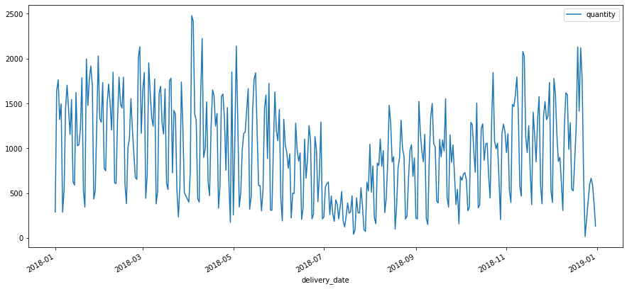
    


    
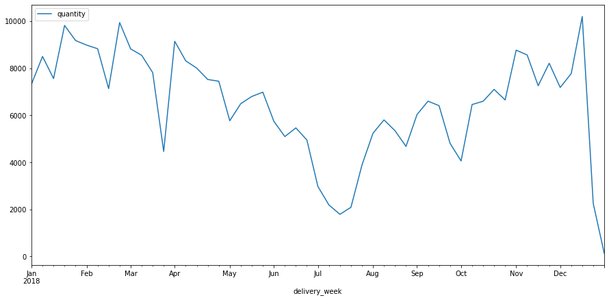
    


```python
def plot_product_quantity(
    product_id, group="product_name", time_agg="delivery_date", df=order_products
):
    df_prod = df.query("product_id == @product_id")
    category = df_prod[group].iloc[0]

    if group == "product_name":
        df_q = df_prod
    elif group == "main_category":
        df_q = df.query("main_category == @category")
    elif group == "sub_category":
        df_q = df.query("sub_category == @category")
    else:
        raise Exception("Invalid `group` parameter.")

    df_plot = df_q.groupby(time_agg).agg(n=("quantity", "sum"))

    if time_agg == "delivery_date":
        idx = pd.date_range("2018-01-01", "2018-12-31")
        df_plot.index = pd.DatetimeIndex(df_plot.index)
        df_plot = df_plot.reindex(idx, fill_value=0)

    return df_plot.rename(columns={"n": category}).plot()
```


```python
plot_product_quantity(987)
plot_product_quantity(16534)
```


    <AxesSubplot:>


    
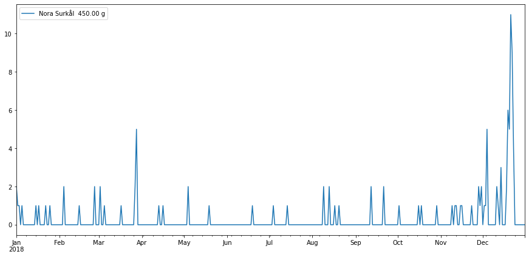
    


    
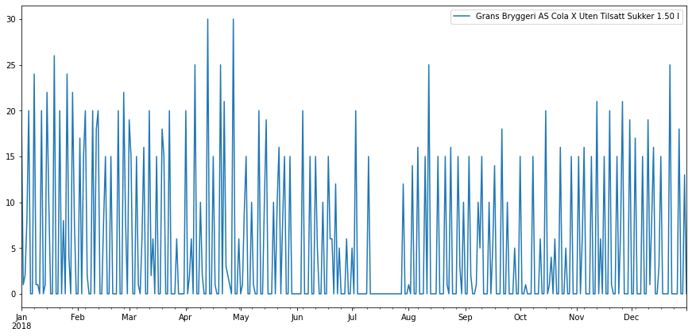
    


```python
## Aggregate per week
plot_product_quantity(987, time_agg="delivery_week")
plot_product_quantity(16534, time_agg="delivery_week")
```


    <AxesSubplot:xlabel='delivery_week'>


    
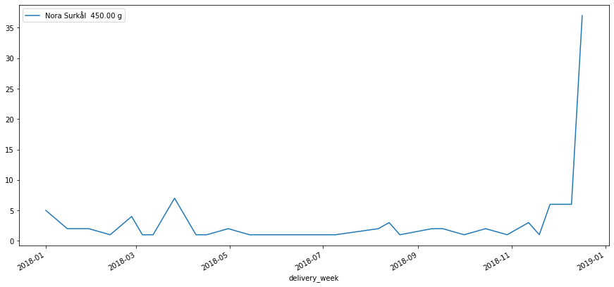
    


    
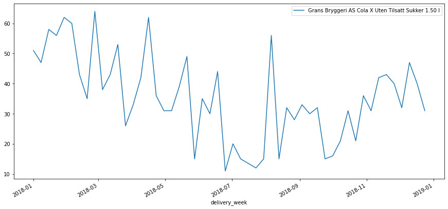
    


```python
plot_product_quantity(
    products.sample().product_id.iloc[0],
    group="main_category",
    time_agg="delivery_week",
)
```


    <AxesSubplot:xlabel='delivery_week'>


    
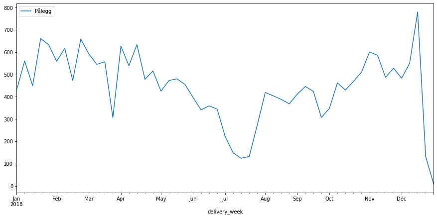
    


```python
plot_product_quantity(
    products.sample().product_id.iloc[0],
    group="sub_category",
    time_agg="delivery_week",
)
```


    <AxesSubplot:xlabel='delivery_week'>


    
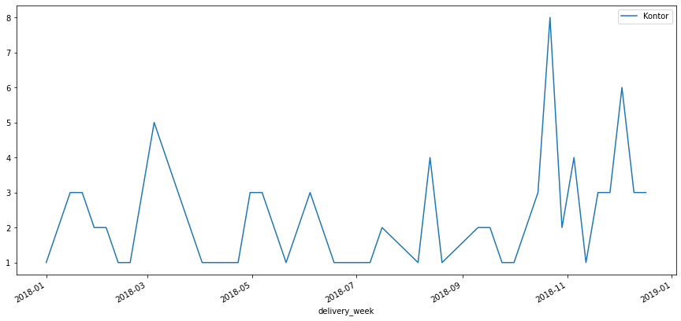
    


```python
plot_product_quantity(
    products.sample().product_id.iloc[0],
    group="sub_category",
    time_agg="delivery_week",
)
```


    <AxesSubplot:xlabel='delivery_week'>


    
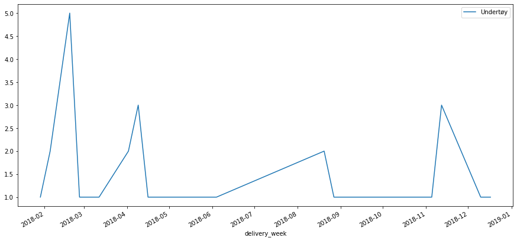
    


```python
plot_product_quantity(
    products.sample().product_id.iloc[0],
    group="sub_category",
    time_agg="delivery_week",
)
```


    <AxesSubplot:xlabel='delivery_week'>


    
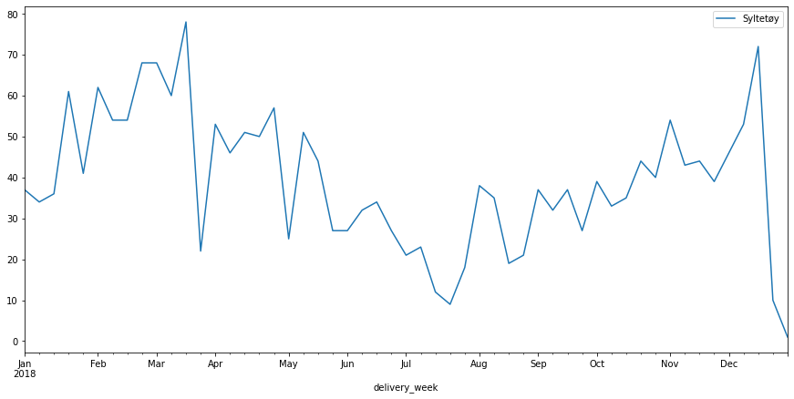
    


```python
plot_product_quantity(
    products.sample().product_id.iloc[0],
    group="sub_category",
    time_agg="delivery_week",
)
```


    <AxesSubplot:xlabel='delivery_week'>


    
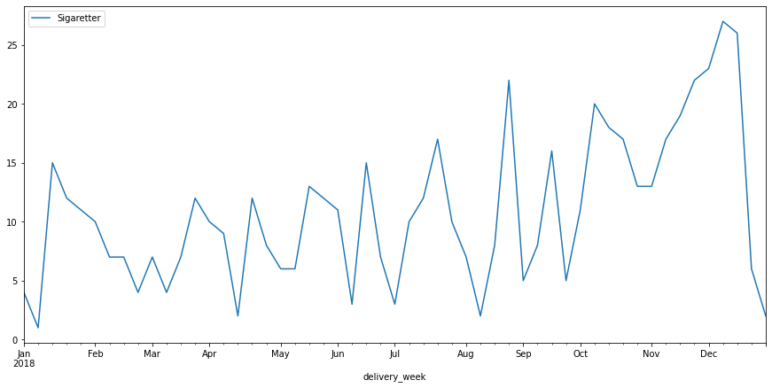
    


```python

```


```python

```

# Prepare data for Hierarchical model


```python
order_products
```


<div>
<style scoped>
    .dataframe tbody tr th:only-of-type {
        vertical-align: middle;
    }

    .dataframe tbody tr th {
        vertical-align: top;
    }

    .dataframe thead th {
        text-align: right;
    }
</style>
<table border="1" class="dataframe">
  <thead>
    <tr style="text-align: right;">
      <th></th>
      <th>order_id</th>
      <th>customer_id</th>
      <th>delivery_date</th>
      <th>is_delivery</th>
      <th>zip_place</th>
      <th>product_id</th>
      <th>quantity</th>
      <th>net_unit_price</th>
      <th>is_from_recipe</th>
      <th>is_from_product_list</th>
      <th>product_name</th>
      <th>main_category</th>
      <th>sub_category</th>
      <th>brand</th>
      <th>delivery_week</th>
    </tr>
  </thead>
  <tbody>
    <tr>
      <th>0</th>
      <td>b5bd36902333660e728adbca18e72db305028c00</td>
      <td>42d70c111366c2e57877a60da9482448c16a92c2</td>
      <td>2018-01-01</td>
      <td>True</td>
      <td>Oslo</td>
      <td>20329</td>
      <td>1.0</td>
      <td>45.22</td>
      <td>False</td>
      <td>False</td>
      <td>Helios Fullkornris Lang  700.00 g</td>
      <td>Middager og tilbehør</td>
      <td>Ris og gryn</td>
      <td>Helios</td>
      <td>2018-01-01</td>
    </tr>
    <tr>
      <th>1</th>
      <td>6ef34c7dd4cad0434a552c322b6754d7502b9bde</td>
      <td>f7e39cc322a01e357c9e9e4c90dd660dcfefe136</td>
      <td>2018-03-12</td>
      <td>True</td>
      <td>Vinterbro</td>
      <td>20329</td>
      <td>1.0</td>
      <td>45.22</td>
      <td>False</td>
      <td>False</td>
      <td>Helios Fullkornris Lang  700.00 g</td>
      <td>Middager og tilbehør</td>
      <td>Ris og gryn</td>
      <td>Helios</td>
      <td>2018-03-12</td>
    </tr>
    <tr>
      <th>2</th>
      <td>3210c4fd4d8e8ec894fad6638389585dee0c73b0</td>
      <td>dc290c4c4245b2d3242f59f214cd20b136f9134c</td>
      <td>2018-04-18</td>
      <td>False</td>
      <td>Oslo</td>
      <td>20329</td>
      <td>1.0</td>
      <td>45.22</td>
      <td>False</td>
      <td>False</td>
      <td>Helios Fullkornris Lang  700.00 g</td>
      <td>Middager og tilbehør</td>
      <td>Ris og gryn</td>
      <td>Helios</td>
      <td>2018-04-16</td>
    </tr>
    <tr>
      <th>3</th>
      <td>3d9cb6cb5146bf5e3841016e1144d7dd418f81a6</td>
      <td>2a795bec85389cd74c7b2a0be9032eeda42dc65e</td>
      <td>2018-05-28</td>
      <td>False</td>
      <td>Oslo</td>
      <td>20329</td>
      <td>1.0</td>
      <td>45.22</td>
      <td>False</td>
      <td>False</td>
      <td>Helios Fullkornris Lang  700.00 g</td>
      <td>Middager og tilbehør</td>
      <td>Ris og gryn</td>
      <td>Helios</td>
      <td>2018-05-28</td>
    </tr>
    <tr>
      <th>4</th>
      <td>a26da49bf193ead0fdb86d7e949b5d3887e8caeb</td>
      <td>2a795bec85389cd74c7b2a0be9032eeda42dc65e</td>
      <td>2018-08-05</td>
      <td>False</td>
      <td>Oslo</td>
      <td>20329</td>
      <td>1.0</td>
      <td>46.09</td>
      <td>False</td>
      <td>False</td>
      <td>Helios Fullkornris Lang  700.00 g</td>
      <td>Middager og tilbehør</td>
      <td>Ris og gryn</td>
      <td>Helios</td>
      <td>2018-07-30</td>
    </tr>
    <tr>
      <th>...</th>
      <td>...</td>
      <td>...</td>
      <td>...</td>
      <td>...</td>
      <td>...</td>
      <td>...</td>
      <td>...</td>
      <td>...</td>
      <td>...</td>
      <td>...</td>
      <td>...</td>
      <td>...</td>
      <td>...</td>
      <td>...</td>
      <td>...</td>
    </tr>
    <tr>
      <th>262286</th>
      <td>fa31252e60f895ba4d6a62bf1d7aa0b000f6dc45</td>
      <td>de93f96e96c8652ee2bd410ded22c161a8b9f668</td>
      <td>2018-12-31</td>
      <td>True</td>
      <td>Oslo</td>
      <td>27470</td>
      <td>1.0</td>
      <td>112.96</td>
      <td>False</td>
      <td>False</td>
      <td>Superlife Topping Tranebær Økologisk 200.00 g</td>
      <td>Brød og frokostblandinger</td>
      <td>Frokostblandinger og gryn</td>
      <td>Superlife</td>
      <td>2018-12-31</td>
    </tr>
    <tr>
      <th>262287</th>
      <td>e3fa57a97071cbe8aafd21f192696ae541e21920</td>
      <td>f5afa34b23f76f31cf1f21cca492683b525b69bd</td>
      <td>2018-12-31</td>
      <td>True</td>
      <td>Oslo</td>
      <td>14854</td>
      <td>1.0</td>
      <td>29.92</td>
      <td>False</td>
      <td>False</td>
      <td>Yatzy i Eske Med 6 Terninger 1.00 stk</td>
      <td>Husholdning og tekstil</td>
      <td>Diverse husholdning</td>
      <td>NaN</td>
      <td>2018-12-31</td>
    </tr>
    <tr>
      <th>262288</th>
      <td>571b7c2f70357404fbe1b748b1a0c33e0906798e</td>
      <td>737323a66ab8d73c6d428735e42bee317d2c8feb</td>
      <td>2018-12-31</td>
      <td>True</td>
      <td>Løvenstad</td>
      <td>1125</td>
      <td>1.0</td>
      <td>49.52</td>
      <td>False</td>
      <td>False</td>
      <td>Weifa Paracet Mikstur 24mg 60.00 ml</td>
      <td>Legemidler og helsekost</td>
      <td>Legemidler</td>
      <td>Weifa</td>
      <td>2018-12-31</td>
    </tr>
    <tr>
      <th>262289</th>
      <td>571b7c2f70357404fbe1b748b1a0c33e0906798e</td>
      <td>737323a66ab8d73c6d428735e42bee317d2c8feb</td>
      <td>2018-12-31</td>
      <td>True</td>
      <td>Løvenstad</td>
      <td>23564</td>
      <td>1.0</td>
      <td>32.96</td>
      <td>False</td>
      <td>False</td>
      <td>FestligeTing Sugerør Blå  24.00 stk</td>
      <td>Barneprodukter</td>
      <td>Bursdag</td>
      <td>FestligeTing</td>
      <td>2018-12-31</td>
    </tr>
    <tr>
      <th>262290</th>
      <td>571b7c2f70357404fbe1b748b1a0c33e0906798e</td>
      <td>737323a66ab8d73c6d428735e42bee317d2c8feb</td>
      <td>2018-12-31</td>
      <td>True</td>
      <td>Løvenstad</td>
      <td>21049</td>
      <td>1.0</td>
      <td>29.12</td>
      <td>False</td>
      <td>False</td>
      <td>Hansa Borg Borg Østlandets Gull  0.50 l</td>
      <td>Øl, cider og rusbrus</td>
      <td>Øl</td>
      <td>Hansa Borg</td>
      <td>2018-12-31</td>
    </tr>
  </tbody>
</table>
<p>262291 rows × 15 columns</p>
</div>


```python
df_model = (
    order_products.groupby(["delivery_week", "main_category"])
    .agg(quantity=("quantity", "sum"))
    .reset_index()
    .query("delivery_week != '2018-12-31'")  # Remove last, single day of year
)
```


```python
# Add holidays by manual inspection. (Could easily be obtained in a real scenario from a calendar)
df_model["holiday"] = np.select(
    [
        df_model["delivery_week"] == "2018-02-19",  # Winter holidays
        df_model["delivery_week"] == "2018-03-26",  # Easter
        df_model["delivery_week"] == "2018-07-02",  # Summer/july holidays
        df_model["delivery_week"] == "2018-07-09",  # Summer/july holidays
        df_model["delivery_week"] == "2018-07-16",  # Summer/july holidays
        df_model["delivery_week"] == "2018-07-23",  # Summer/july holidays
        df_model["delivery_week"] == "2018-12-24",  # Christmas
    ],
    [1 for _ in range(7)],
    default=0,
)
```


```python
df_model["last_quantity"] = df_model.groupby("main_category")["quantity"].shift()
```


```python
# Skip first week due to missing 'last_quantity' and drop 'delivery_week' column
df_model = df_model.query("delivery_week != '2018-01-01'").drop(
    ["delivery_week"], axis=1
)
```


```python
df_model
```


<div>
<style scoped>
    .dataframe tbody tr th:only-of-type {
        vertical-align: middle;
    }

    .dataframe tbody tr th {
        vertical-align: top;
    }

    .dataframe thead th {
        text-align: right;
    }
</style>
<table border="1" class="dataframe">
  <thead>
    <tr style="text-align: right;">
      <th></th>
      <th>main_category</th>
      <th>quantity</th>
      <th>holiday</th>
      <th>last_quantity</th>
    </tr>
  </thead>
  <tbody>
    <tr>
      <th>30</th>
      <td>Asiatisk</td>
      <td>40.0</td>
      <td>0</td>
      <td>48.0</td>
    </tr>
    <tr>
      <th>31</th>
      <td>Barneprodukter</td>
      <td>315.0</td>
      <td>0</td>
      <td>251.0</td>
    </tr>
    <tr>
      <th>32</th>
      <td>Blomster og planter</td>
      <td>14.0</td>
      <td>0</td>
      <td>4.0</td>
    </tr>
    <tr>
      <th>33</th>
      <td>Brød og frokostblandinger</td>
      <td>498.0</td>
      <td>0</td>
      <td>516.0</td>
    </tr>
    <tr>
      <th>34</th>
      <td>Drikkevarer</td>
      <td>567.0</td>
      <td>0</td>
      <td>412.0</td>
    </tr>
    <tr>
      <th>...</th>
      <td>...</td>
      <td>...</td>
      <td>...</td>
      <td>...</td>
    </tr>
    <tr>
      <th>1527</th>
      <td>Shampo, såpe og hudpleie</td>
      <td>7.0</td>
      <td>1</td>
      <td>62.0</td>
    </tr>
    <tr>
      <th>1528</th>
      <td>Snacks og godteri</td>
      <td>192.0</td>
      <td>1</td>
      <td>628.0</td>
    </tr>
    <tr>
      <th>1529</th>
      <td>Snus og tobakk</td>
      <td>16.0</td>
      <td>1</td>
      <td>38.0</td>
    </tr>
    <tr>
      <th>1530</th>
      <td>Tørkepapir og vaskemidler</td>
      <td>54.0</td>
      <td>1</td>
      <td>294.0</td>
    </tr>
    <tr>
      <th>1531</th>
      <td>Øl, cider og rusbrus</td>
      <td>50.0</td>
      <td>1</td>
      <td>218.0</td>
    </tr>
  </tbody>
</table>
<p>1502 rows × 4 columns</p>
</div>


```python
# Check number of products, sub_category and main_category
products.nunique()
```


    product_id       5978
    product_name     5977
    main_category      32
    sub_category      182
    brand             525
    dtype: int64


# Problem formulation

$$q_i \sim Normal(\mu_i, \sigma)$$

$$\mu_i = \alpha + \alpha_{MAIN[i]} + \alpha_{SUB[i]} + \beta_{HOLIDAY[i]}H_i + \beta_{TEMP[i]}T_i + \beta_{PRECIP[i]}P_i + \beta_{LASTQUANTITY[i]}Q_i$$

$$\alpha_{MAIN} \sim Normal(0, \sigma_{MAIN})$$

$$\alpha_{SUB} \sim Normal(0, \sigma_{SUB})$$

$$\alpha \sim Normal(0, 10)$$

$$\beta_{HOLIDAY} \sim Normal(0, \sigma_{HOLIDAY})$$

$$\beta_{TEMP} \sim Normal(0, \sigma_{TEMP})$$

$$\beta_{PRECIP} \sim Normal(0, \sigma_{PRECIP})$$

$$\beta_{LASTQUANTITY} \sim Normal(1, \sigma_{LASTQUANTITY})$$

$$\sigma_{LASTQUANTITY} \sim HalfCauchy(0, 1)$$

$$\sigma, \sigma_{SUB}, \sigma_{MAIN}, \sigma_{HOLIDAY}, \sigma_{TEMP}, \sigma_{PRECIP} \sim HalfCauchy(0, 1)$$


## Variables explained

- $q_i$ = quantity prediction for `sub_category` $i$
- $H$ = holiday indicator variable
- $T$ = temperature (forecasted)
- $P$ = precipation (forecasted)
- $Q$ = quantity observed last week for `sub_category` $i$

## Thoughts

- Final model will certainly not look like this.
- Multivariate Normal for `TEMP` and `PRECIP`?
- Residuals can be checked in $\sigma$


```python

```


```python

```
